# Insider Threat IR Lab

*Following the NIST Incident Response process to investigate a simulated insider-threat data leak in an Active Directory environment*

---

## Summary

This project simulates an insider threat investigation at a fictional company, Good Trade, which specializes in finance and consulting. The company runs a centralized Active Directory server that manages all endpoint access, policy, and logging.

Acting as the incident response team, I followed the [NIST Incident Response process](https://csrc.nist.gov/projects/incident-response) to investigate a data leak: enabling the AD audit policies needed to catch file access and removable-media activity, planting a honey file to bait the insider, then using the resulting Windows Security event logs to identify the source of the leak, contain it, and document lessons learned.

## Scenario

An executive at Good Trade noticed that internal information was being leaked to competitors and asked the incident response team to investigate the origin of the leak. An insider threat is anyone with legitimate knowledge of an organization such as a current or former employee, contractor, or vendor; who uses that access to cause harm, whether through espionage, unauthorized disclosure, or sabotage.

The company follows the [NIST Incident Response](https://csrc.nist.gov/projects/incident-response) framework: Preparation; Detection and Analysis; Containment, Eradication and Recovery; Post-Incident Activity.

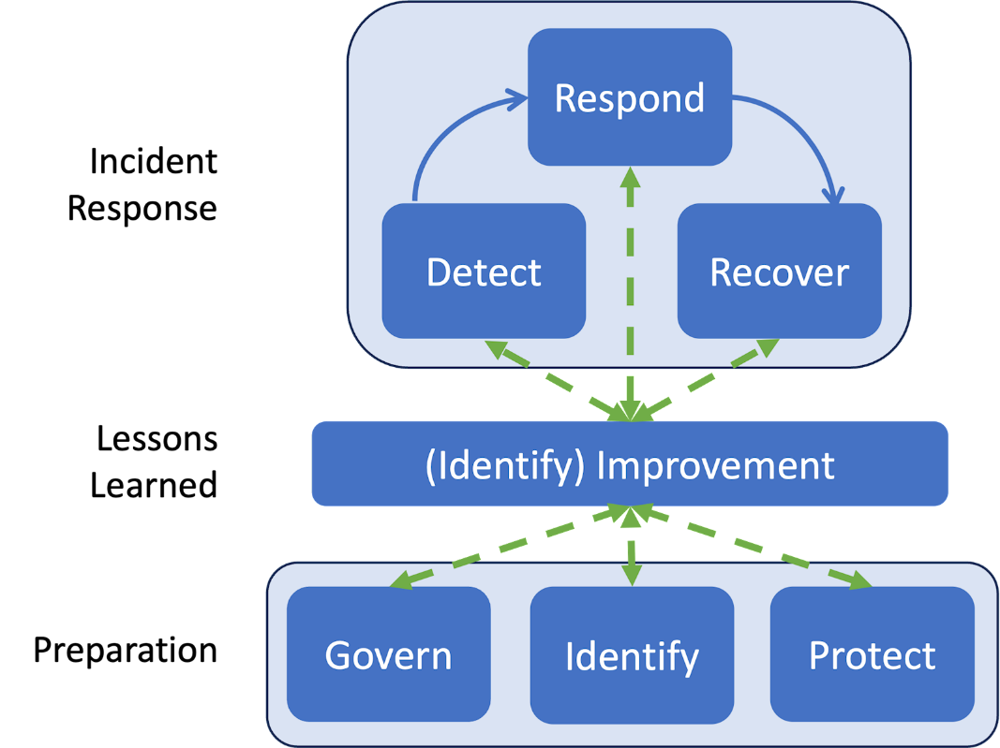

The current step of the IR process is an early detection as it has been identified that information is being leaked. The next step is to further investigate for a clear detection of the source of the leak, block the source of leak and improve the current security of the company.

---

## Detection & Hands-On Investigation

### Enabling Audit Policies

Before setting the honey file, the IR team needed visibility. The first step was enabling the audit policies required to catch file access and removable-storage activity on the AD Domain Controller, each configured to log both successful and failed attempts:

- **Audit File System** — audits user attempts to access file system objects.
- **Audit Removable Storage** — audits user attempts to access file system objects on a removable device.
- **Audit Detailed File Share** — detailed logs for every user attempt to access shared files and folders.
- **Audit File Share** — logs for every attempt to access shared folders.

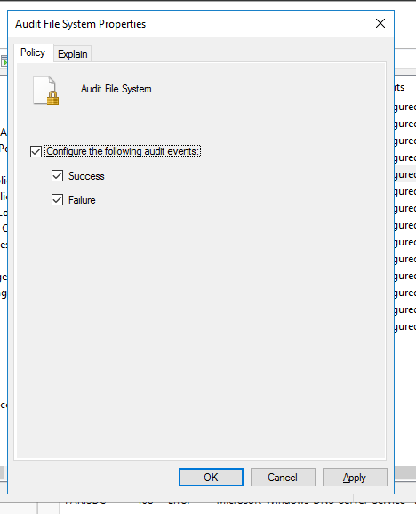
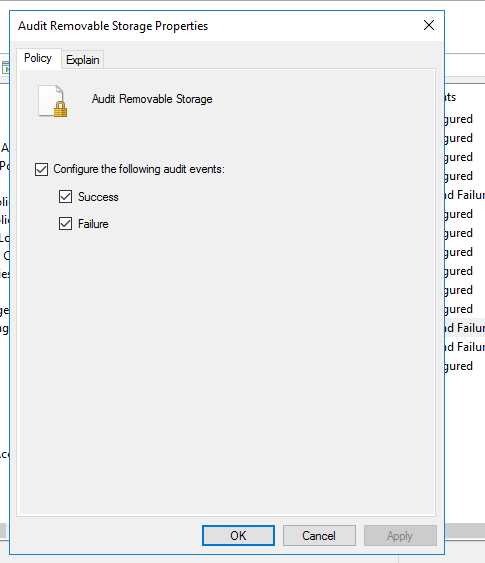
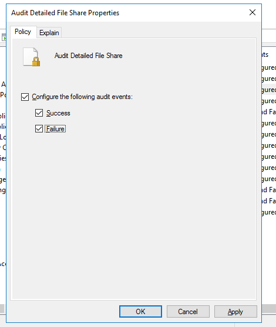
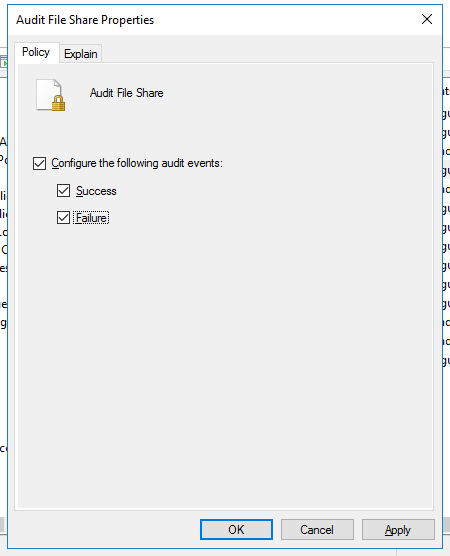

The Local Security Policy console confirms all four subcategories are now set to log **Success and Failure**.

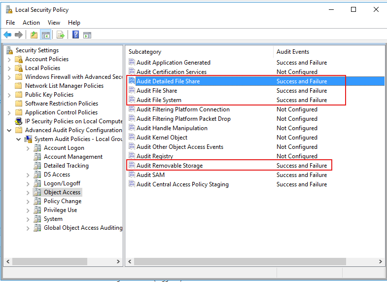

### Planting the Honey File

After enabling the audit logs, the IR team created a honey file named `New Company Strategy`. The file was shared with few groups existing in the company such as Marketing, Sales, and SecOps. 

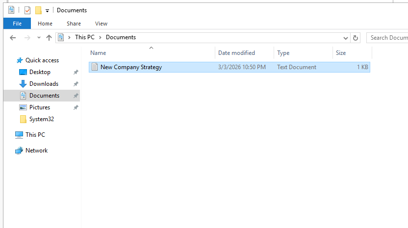

The file's auditing entries were set so that read/write access from each of these groups would be logged.

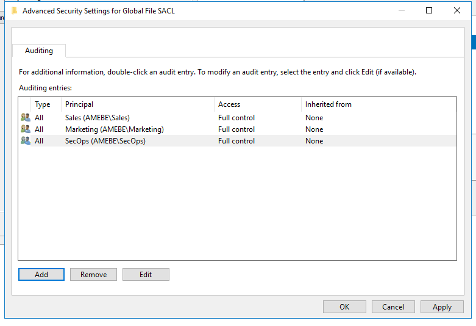

The IR team then shared the file with the Marketing and Sales groups over the network.

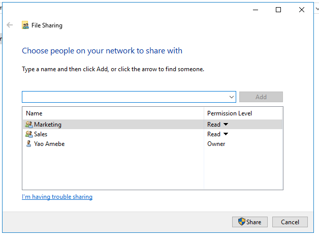

The file was shared successfully and made available at `\\PARISDC\Users\yamebe\Documents\New Company Strategy.txt`.

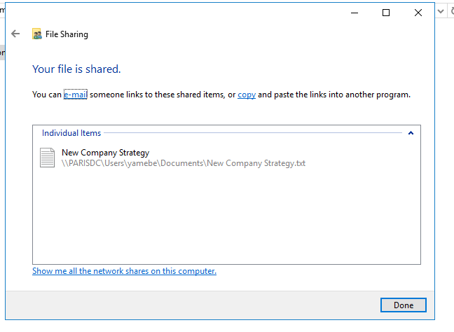

### Insider Threat Actions

The insider threat had access to the honey file.

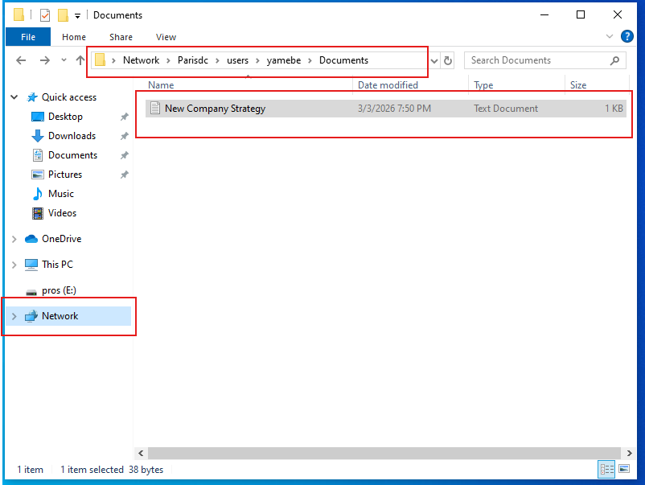

The insider then copied the file onto a USB flash drive (`pros (E:)`).

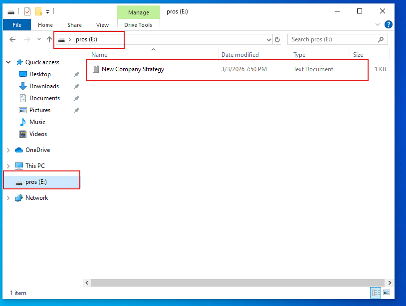

### IR Team Investigation

With the bait taken, the IR team went back to the Security event log on the AD Domain Controller to trace what happened.

**Event ID 5145** (Detailed File Share) shows `AMEBE\banderson` requesting read/write access to a shared network file identified by the Relative Target Name `srvsvc` around the time the honey file was accessed.

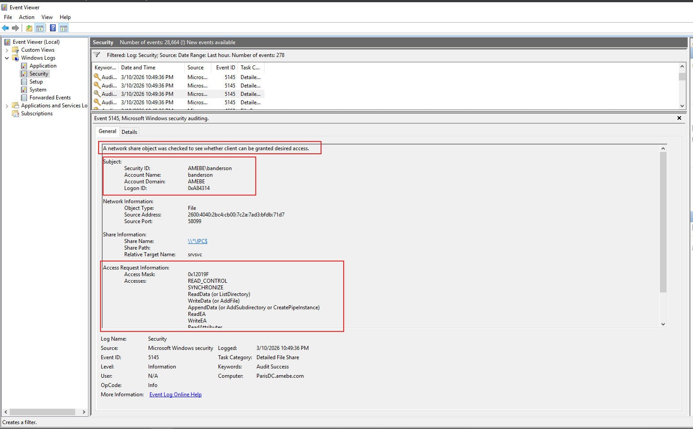

**Event ID 4663** (File System) confirms the same account, `banderson`, directly accessing `C:\Users\yamebe\Documents\New Company Strategy.txt`.

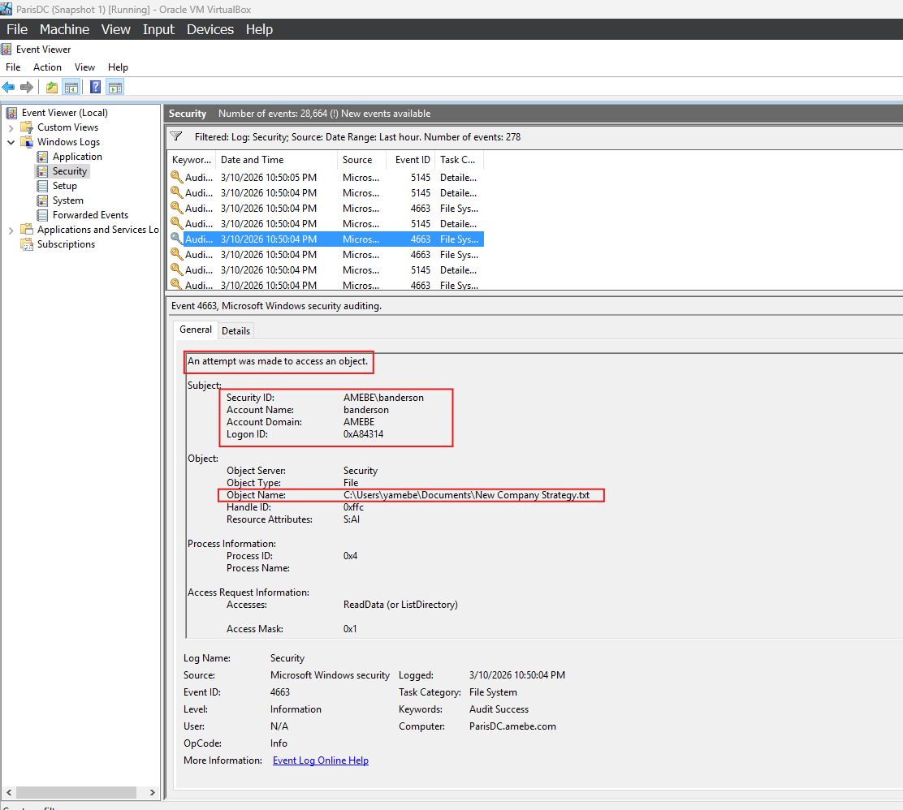

**Event ID 6416** (Plug and Play) shows a USB flash disk being recognized by `banderson`'s workstation around the same time, corroborating the earlier screenshot of the file being copied to drive `E:`.

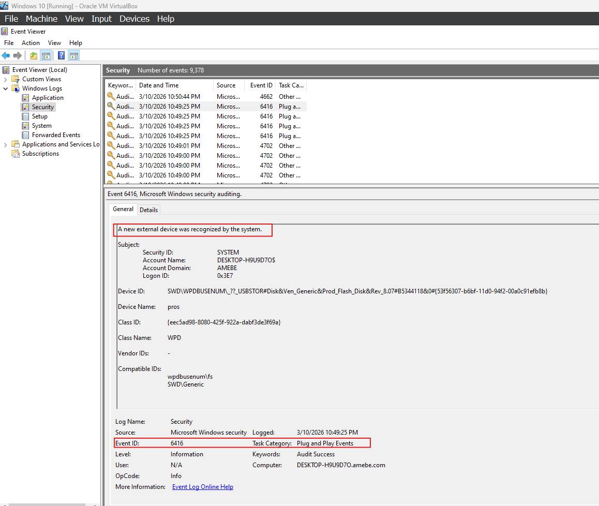

Useful reference: [Windows Security Log Event ID 4663](https://system32.eventsentry.com) and the Windows Security auditing documentation cover what each of these event IDs records.

### IR Report

Correlating the file-share access (5145), the file-object access (4663), and the USB device connection (6416) all tied to the same account and the same narrow time window. The investigation concludes that **Broo Anderson** (`banderson`) is the source of the leak: he was the only account to access the honey file, and he copied it to a USB flash drive shortly after.

---

## Recovery and Remediation

The IR team's containment and remediation actions:

- **Disabled Broo Anderson's account** to immediately cut off further access.
- **Enforced the principle of least privilege** on company data going forward.
- **Disabled write access to removable devices**, to prevent this exfiltration path from being used again.

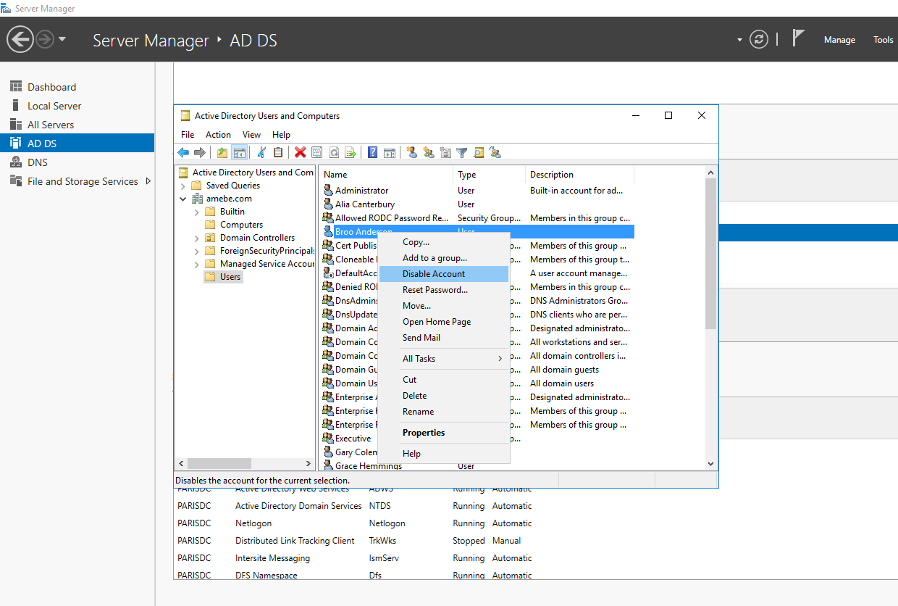

With the account disabled, Broo Anderson is no longer able to log in.

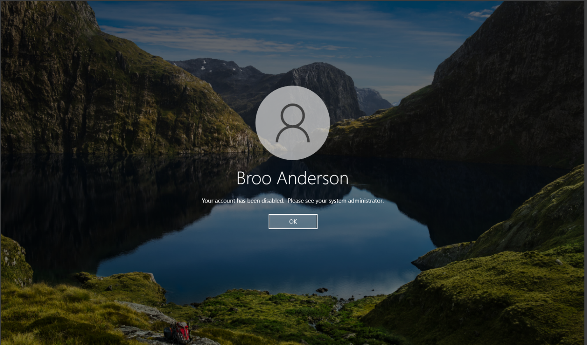

## Lessons Learned

- Apply the principle of least privilege on sensitive data.
- Disable removable-drive write access by default.
- Keep file-access auditing on at all times, rather than enabling it only after a leak is suspected, for faster detection next time.
- Install log aggregation/SIEM tooling to make cross-event correlation faster and more accurate during an investigation.

---

## Work Cited

Computer Security Division, Information Technology Laboratory. "Incident Response." *CSRC*, [csrc.nist.gov/projects/incident-response](https://csrc.nist.gov/projects/incident-response). Accessed 8 Mar. 2026.

"Defining Insider Threats | CISA." *CISA*, [www.cisa.gov/topics/physical-security/insider-threat-mitigation/defining-insider-threats](https://www.cisa.gov/topics/physical-security/insider-threat-mitigation/defining-insider-threats). Accessed 8 Mar. 2026.

