# SOC Detection Lab

*Simulating and detecting real-world attack techniques in a self-built Active Directory environment*

---

## Summary

This lab is a self-hosted Security Operations Center (SOC) environment built to simulate an enterprise Active Directory network, ingest logs into a centralized SIEM, and map detection against real MITRE ATT&CK techniques. The environment includes a Windows Server 2022 Domain Controller populated with a realistic AD structure (using BadBlood), a domain-joined Windows 10 endpoint, a pfSense gateway/firewall, and a Splunk Enterprise deployment for log aggregation and detection activities.

Using Atomic Red Team, I simulated MITRE ATT&CK techniques such as Kerberoasting (T1558.003) and Credential Dumping (T1003) against the environment and built Splunk detection queries to identify and investigate each technique.

## Architecture

### Diagram

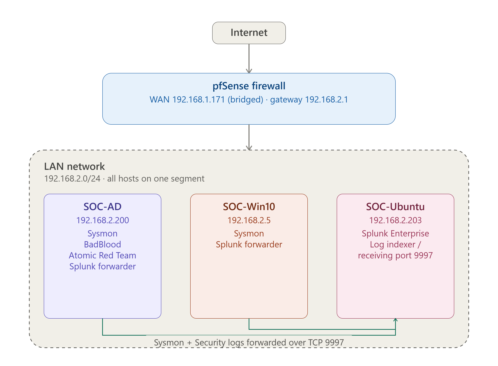

### Environment Setup & Verification

This is the pfSense showing the WAN and LAN interface configuration. 

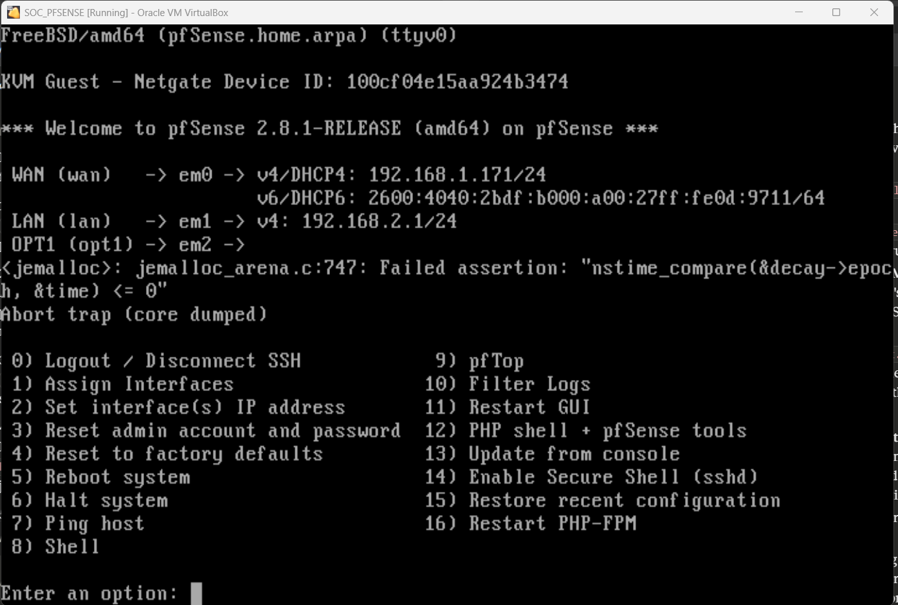

Here, I confirmed the static IP address I set for the AD Domain Controller and tested the connectivity with the pfSense gateway.

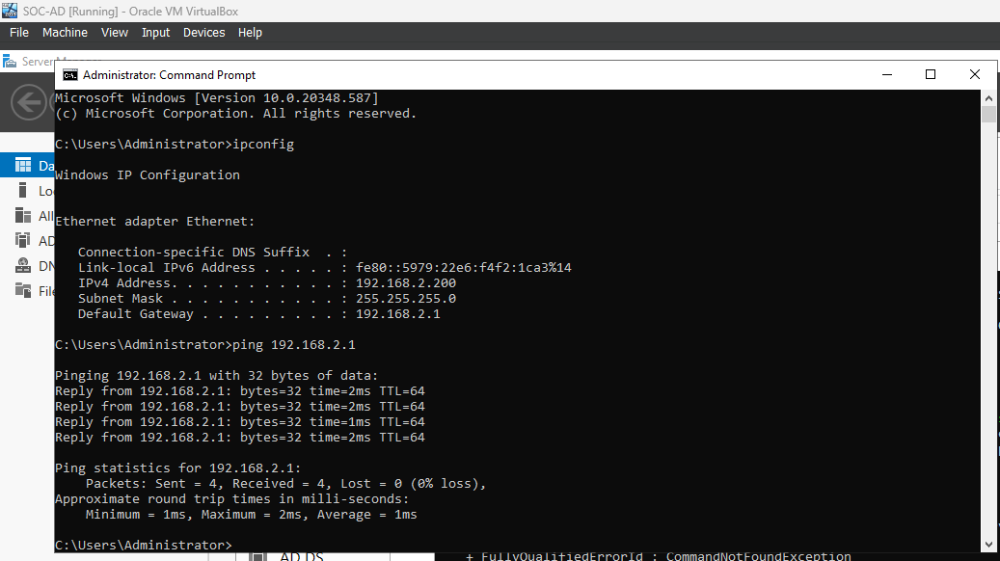

On the Windows 10 that joined the DC, I also checked the IP, connectivity with the pfSense Default Gateway and the confirmation of domain membership (`soclab.com`).

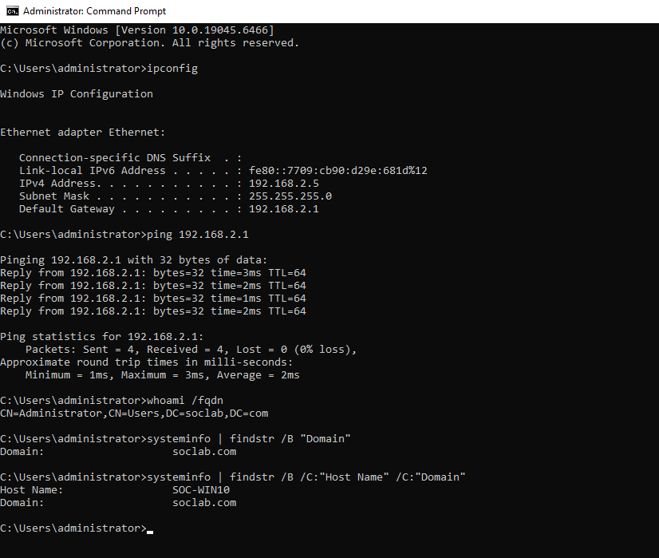

On the Splunk host (SOC-Ubuntu), I ran the same network connectivity as the previous VMs.

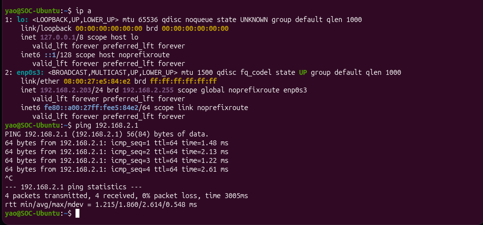

On the Active Directory, I checked the AD Users and Computers to confirm that it was populated via BadBlood.

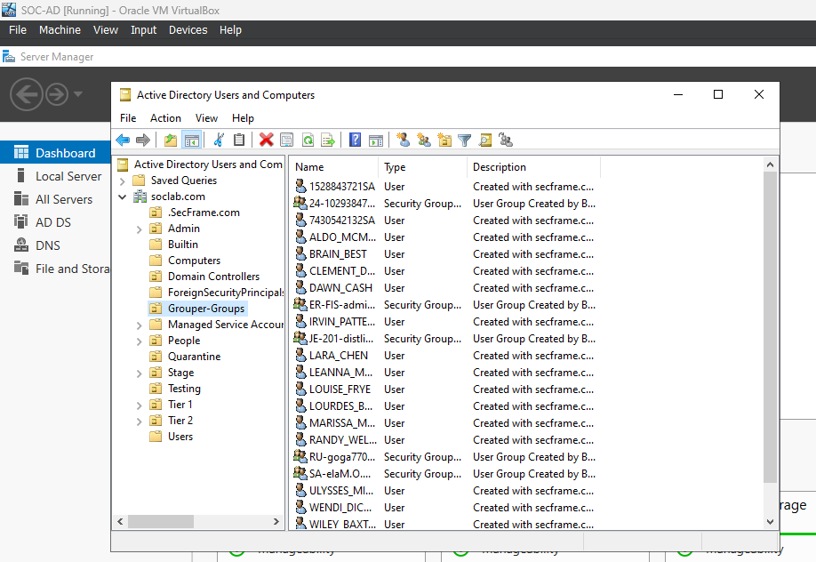


### Design Choices

All lab hosts sit on an isolated LAN behind pfSense, which let me run offensive tooling (Atomic Red Team) safely without exposing the host network. I also planned to send pfSense logs to the Splunk server for future labs.

I used BadBlood to populate the AD instead of testing against a default domain since a realistic directory with actual groups and service accounts gives techniques like Kerberoasting something meaningful to target.

---

## Splunk Deployment & Log Pipeline

### Forwarder-Side Configuration

I downloaded the Windows Splunk universal forwarder from the official website and installed it on the AD Domain Controller. 

Useful link: [Install a Windows universal forwarder from an installer](https://help.splunk.com/en/splunk-cloud-platform/forward-and-process-data/universal-forwarder-manual/9.4/install-the-universal-forwarder/install-a-windows-universal-forwarder#a19ec22d_68d3_4a7f_b41c_456267545717--en__Install_a_Windows_universal_forwarder_from_an_installer)

After launching the installer I downloaded, I accepted the License Agreement, kept the default installation option and selected "Next".

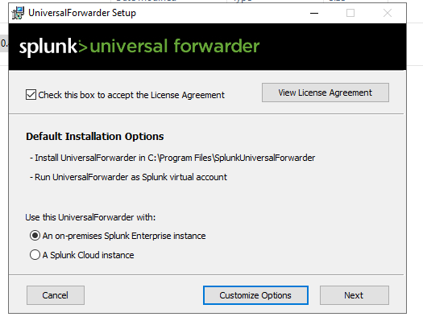

On the Next page, I added a local admin with a password.

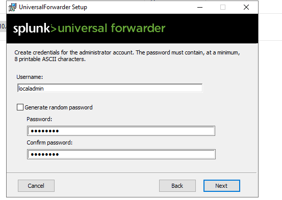

Here, I set the Receiving Indexer IP with the Ubuntu VM IP address and used the default port 9997.

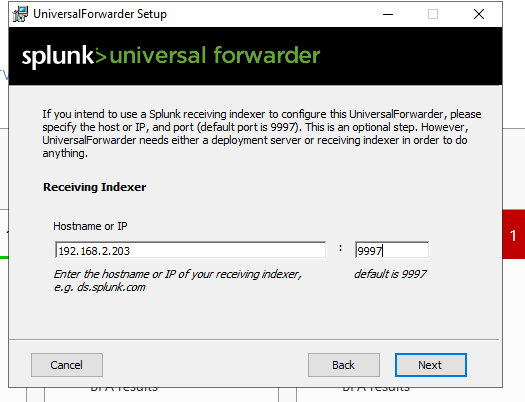

The universal forwarder was successfully installed.

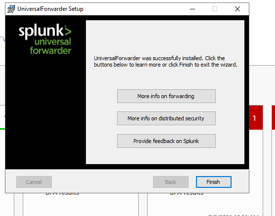

I also checked the Windows Services to make sure the Splunk Forwarder was successfully installed and running.

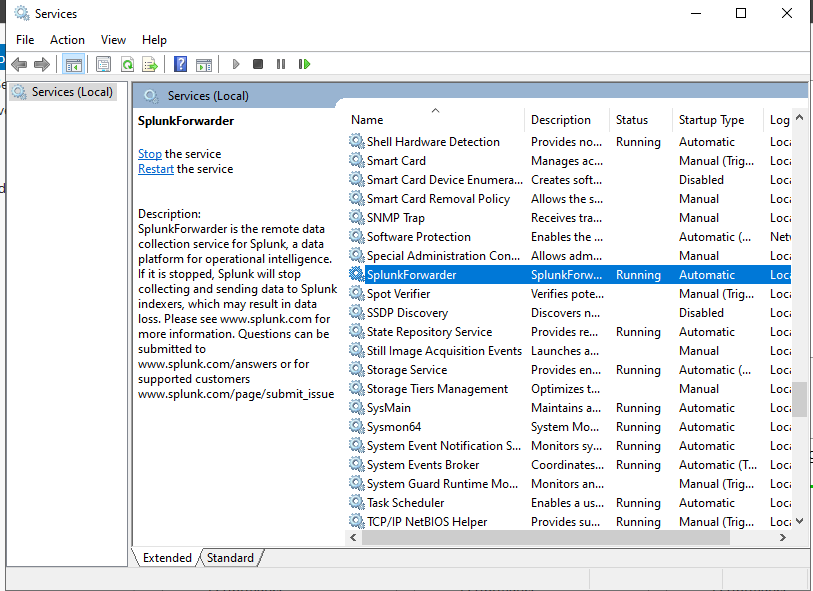

Next, I set up the `C:\Program Files\SplunkUniversalForwarder\etc\system\local\inputs.conf` file to collect Windows security, Application, System and Sysmon logs using this configuration.

`C:\Program Files\SplunkUniversalForwarder\etc\system\local\inputs.conf`:

```ini
[WinEventLog://Security]
disabled = 0
start_from = oldest
current_only = 0
index = windows
renderXml = 1

# Collect Standard Windows Application Logs
[WinEventLog://Application]
disabled = 0
start_from = oldest
current_only = 0
index = windows
renderXml = 1

# Collect Standard Windows System Logs
[WinEventLog://System]
disabled = 0
start_from = oldest
current_only = 0
index = windows
renderXml = 1

[WinEventLog://Microsoft-Windows-Sysmon/Operational]
index = sysmon
disabled = false
renderXml = true
```

The `C:\Program Files\SplunkUniversalForwarder\etc\system\local\outputs.conf` also has the correct config info related to the Splunk client.

`outputs.conf`:

```ini
[tcpout]
defaultGroup = default-autolb-group

[tcpout:default-autolb-group]
server = 192.168.2.203:9997

[tcpout-server://192.168.2.203:9997]
```

I also checked my active forwards using the command:

~~~powershell linenums="1" title="Check active Splunk forwards"
& "C:\Program Files\SplunkUniversalForwarder\bin\splunk.exe" list forward-server
~~~

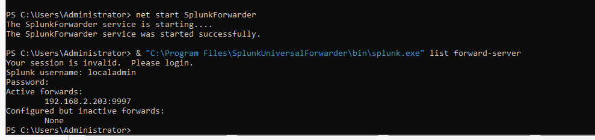

### Windows Audit Policy Changes Required

Since I will be running the Kerberoasting technique test, I enabled the necessary Audit logs in the Local Security Policy on the AD Domain Controller.

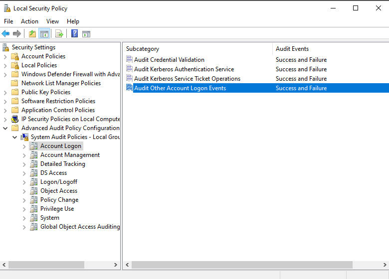

### Server-Side Configuration

I downloaded Splunk Enterprise on the Ubuntu VM using `wget`.

~~~bash linenums="1" title="Download Splunk Enterprise"
wget -O splunk-10.4.1-5a009d941268-linux-amd64.deb "https://download.splunk.com/products/splunk/releases/10.4.1/linux/splunk-10.4.1-5a009d941268-linux-amd64.deb"
~~~

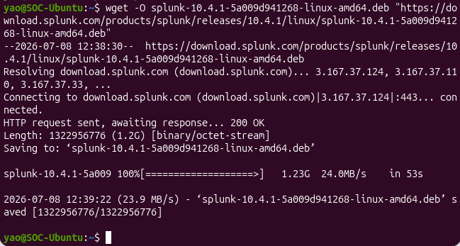

After installing the package, I started Splunk and accepted the license, which prompted me to create the admin account on first run.

~~~bash linenums="1" title="Start Splunk Enterprise and enable boot-start"
sudo /opt/splunk/bin/splunk start --accept-license --run-as-root
sudo /opt/splunk/bin/splunk enable boot-start
~~~

The `--run-as-root` is required to run Splunk with root privileges.

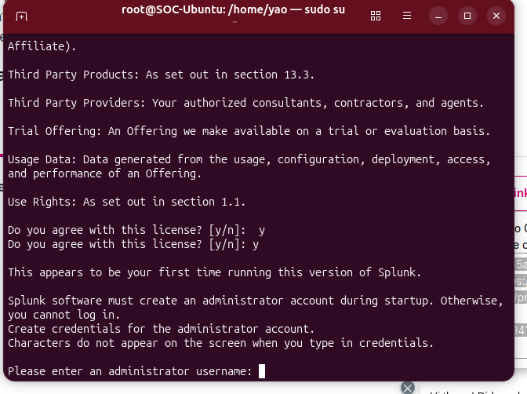

Splunk started the web interface at `http://SOC-Ubuntu:8000`.

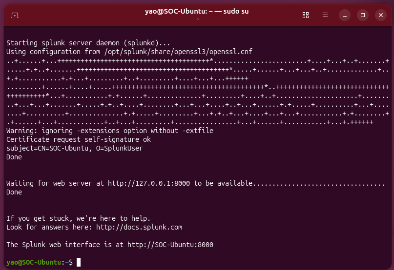

I opened the given web interface and logged into the Splunk web UI.

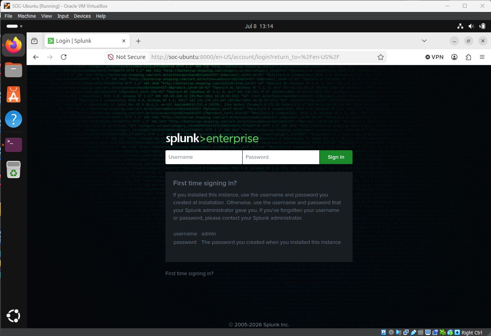

This confirmed the Splunk Enterprise instance was up and reachable through the web interface.

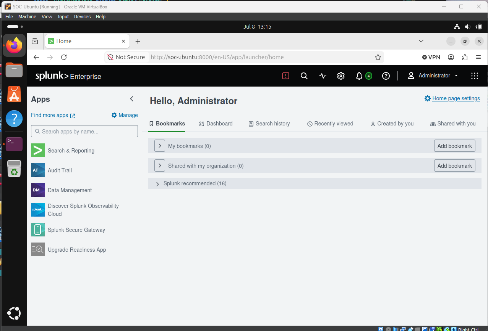

Under Settings > Forwarding and receiving, I configured Splunk to receive data on the default port 9997. The same port was used when setting up the receiver on the Windows AD.

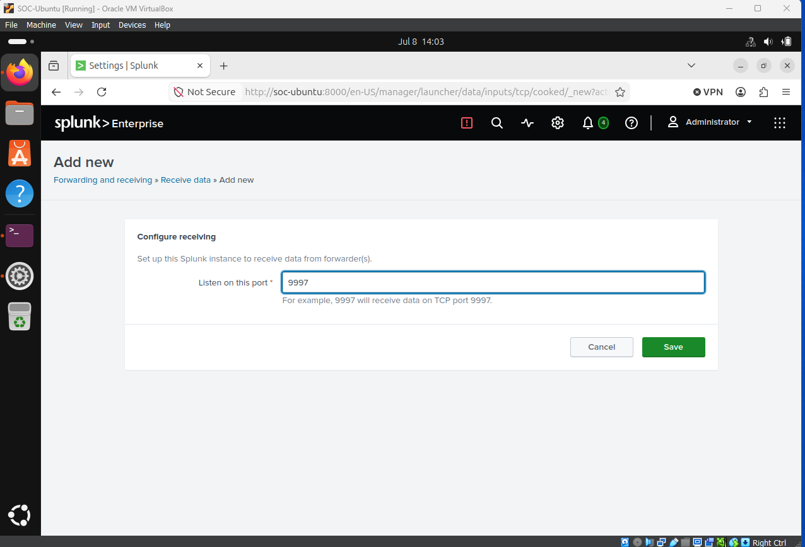

I then created two custom indexes, `windows` and `sysmon`, to separate Windows Event Log data from Sysmon telemetry.

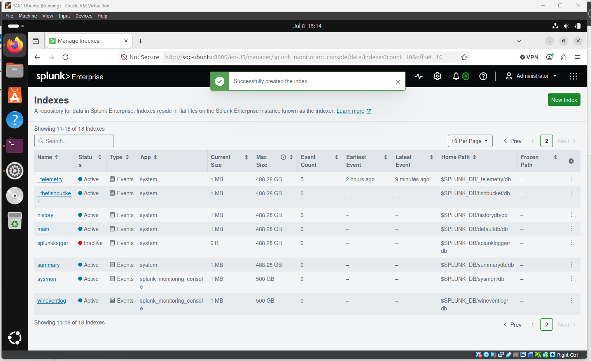

I checked `_internal` metrics to confirm the forwarders were actively connected to the indexer.

~~~spl linenums="1" title="Verify forwarder connections"
index=_internal source=*metrics.log group=tcpin_connections
~~~

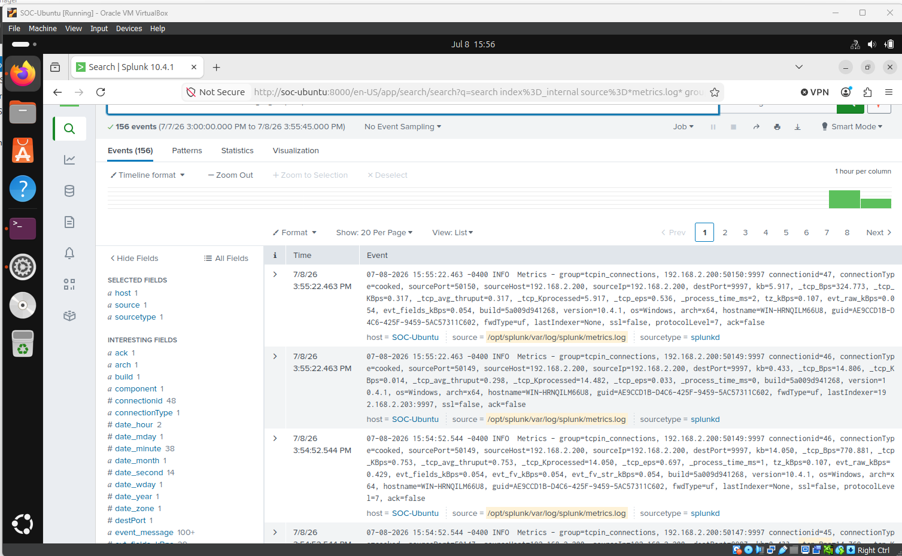

I also ran a broad search against the Domain Controller's hostname to confirm its data was landing in the correct indexes.

~~~spl linenums="1" title="Verify indexed data by host"
index=* host="WIN-HRNQILM66U8"
~~~

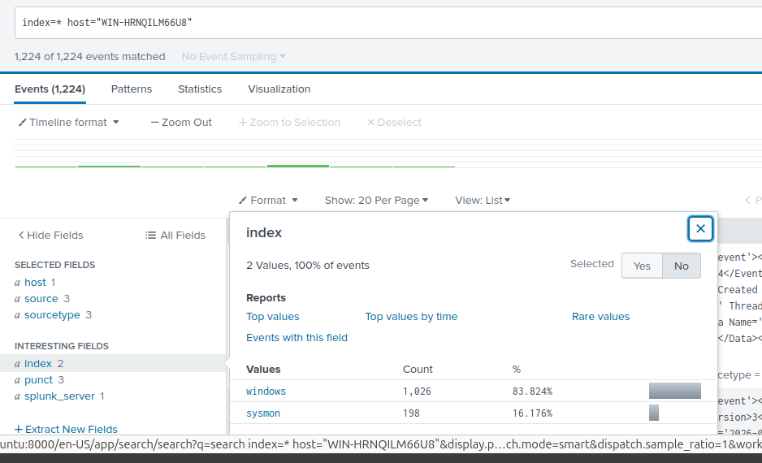

Finally, I installed the Splunk Add-on for Microsoft Windows, which is required for field-level extraction (`EventCode`, `Account_Name`, etc.) on the indexed Windows data.

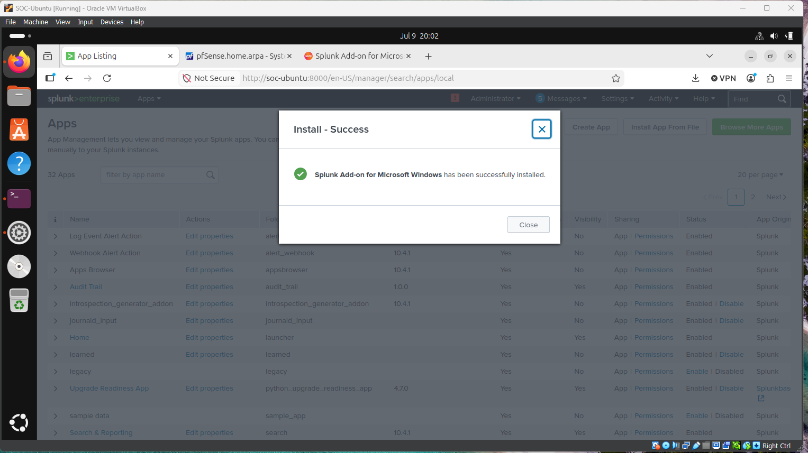

### Lessons Learned (Setup)

- **Config filenames are exact-match** — I named one config file `input.conf` instead of `inputs.conf` which was silently ignored by Splunk, with no error raised. I spent some time figuring out how I could confirm the connection between the Splunk forwarder on the Windows AD and the Splunk Client, with no log sent.
- **Field extraction requires the Windows Add-on** — to easily perform searches on the data collected by Splunk, the Splunk Add-on for Microsoft Windows is a must.

---

## Attack Simulation & Detection

### Kerberoasting (T1558.003)

Before running any attack simulations, I installed AtomicRedTeam on the Windows AD Domain Controller and made sure the Splunk Forwarder was running so the activity would actually be captured.

~~~powershell linenums="1" title="Install Invoke-AtomicRedTeam"
net start SplunkForwarder
IEX (IWR 'https://raw.githubusercontent.com/redcanaryco/invoke-atomicredteam/master/install-atomicredteam.ps1' -UseBasicParsing); Install-AtomicRedTeam -getAtomics -Force
~~~

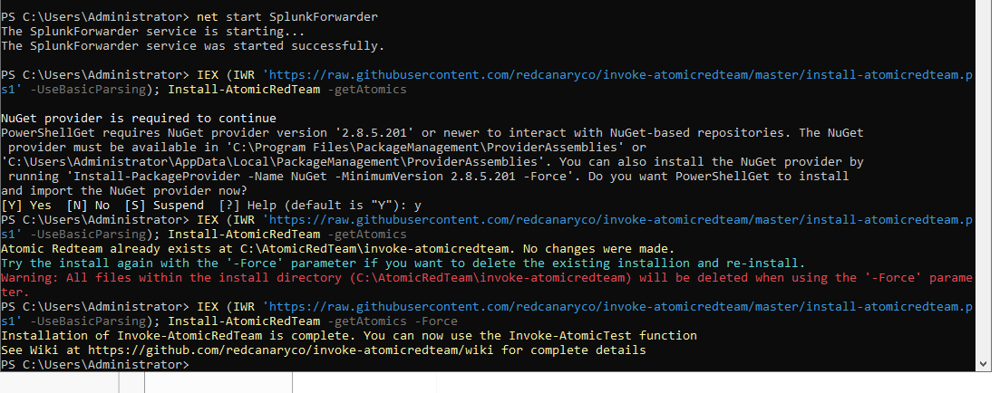

I then ran the Kerberoasting atomic test using the command below. Some tests did not succeed, but I got enough logs for my investigation.

Find more about [T1558.003 - Kerberoasting](https://attack.mitre.org/techniques/T1558/003/).

~~~powershell linenums="1" title="Run Kerberoasting atomic test"
Invoke-AtomicTest T1558.003
~~~

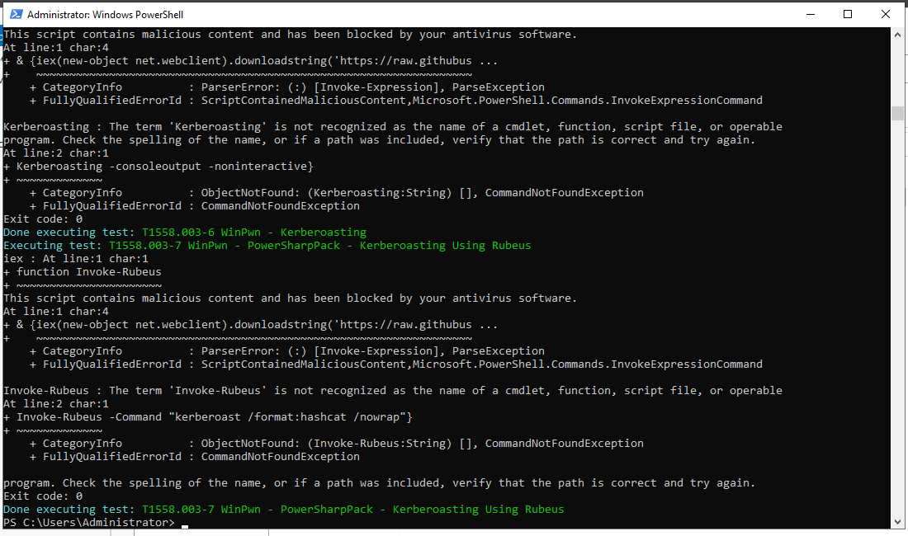

I searched for logs about Event ID 4769 (Kerberos Service Ticket Operations) and got some results. I filtered the log to a time range of last 4 hours to not miss any data.

I also noticed some service tickets requested with `TicketEncryptionType=0x17 (RC4)` instead of the current types `0x11/0x12 (AES128/AES256)`. This indicates Kerberoasting activities.

Useful ticket encryption type link: [Kerberos Encryption Types](https://system32.eventsentry.com/codes/field/Kerberos%20Encryption%20Types)


~~~spl linenums="1" title="Search for Kerberos service ticket requests"
index="windows" EventCode=4769 host="WIN-HRNQILM66U8"
~~~

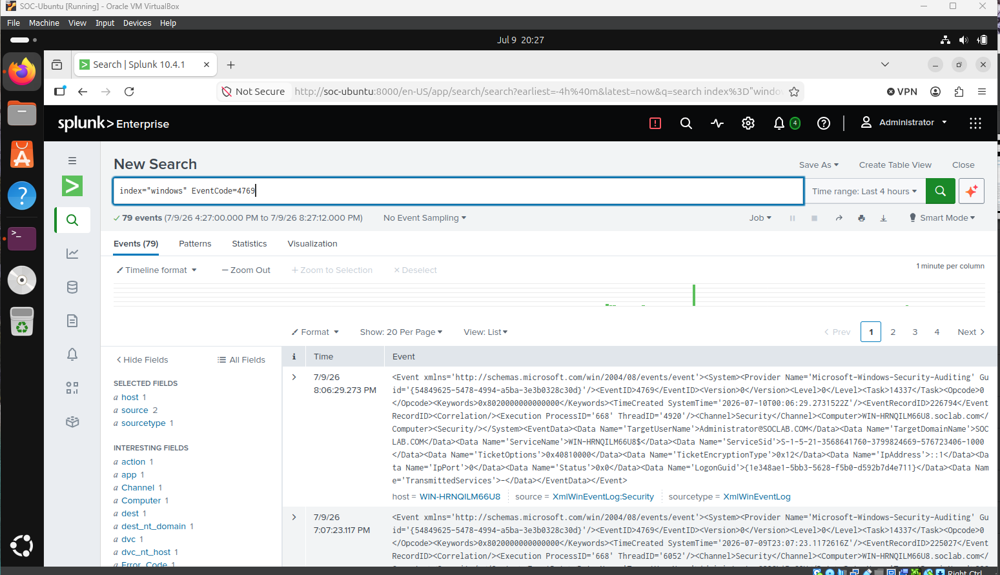
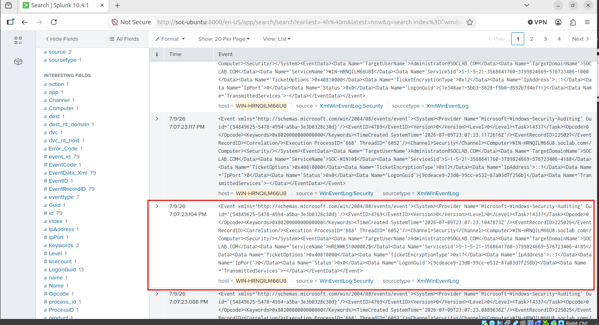

I refined the search into a table and noticed that the `Administrator@SOCLAB.COM` account requested tickets for a long list of unrelated service accounts in rapid succession, almost all using RC4 (0x17). This is a proof of a tool enumerating and roasting every Service Principal Name (SPN) in the domain.

~~~spl linenums="1" title="Refine Kerberoasting detection query"
index="windows" EventCode=4769 host="WIN-HRNQILM66U8" | table _time, TargetUserName, ServiceName, TicketEncryptionType | sort -_time
~~~

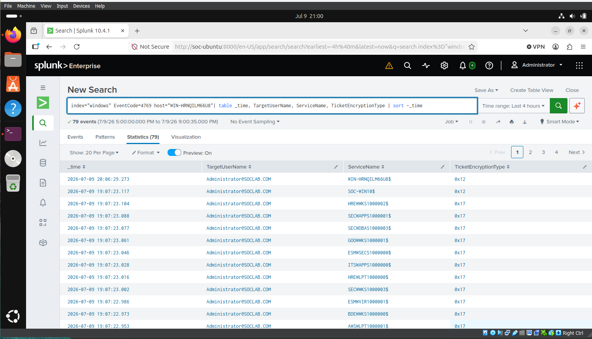

### Credential Dumping (T1003)

I ran the specific Credential Dumping atomic tests — some tests failed, but I got enough data for my investigation.

~~~powershell linenums="1" title="Run Credential Dumping atomic tests"
Invoke-AtomicTest T1003
~~~

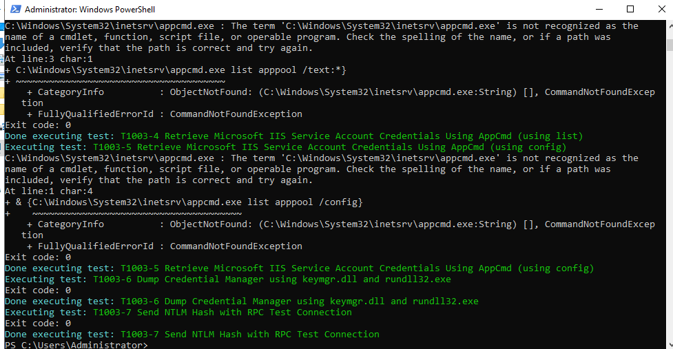

Looking at the process chain this generated, Sysmon first tagged an earlier step as `technique_id=T1055.001, technique_name=Dynamic-link Library Injection`: `powershell.exe` injected into `rundll32.exe`, before `rundll32.exe` targeted `svchost.exe`.

~~~spl linenums="1" title="Inspect the DLL injection / credential dumping chain"
index=* host="WIN-HRNQILM66U8" EventCode=10 | table _time, _raw, TargetImage
~~~

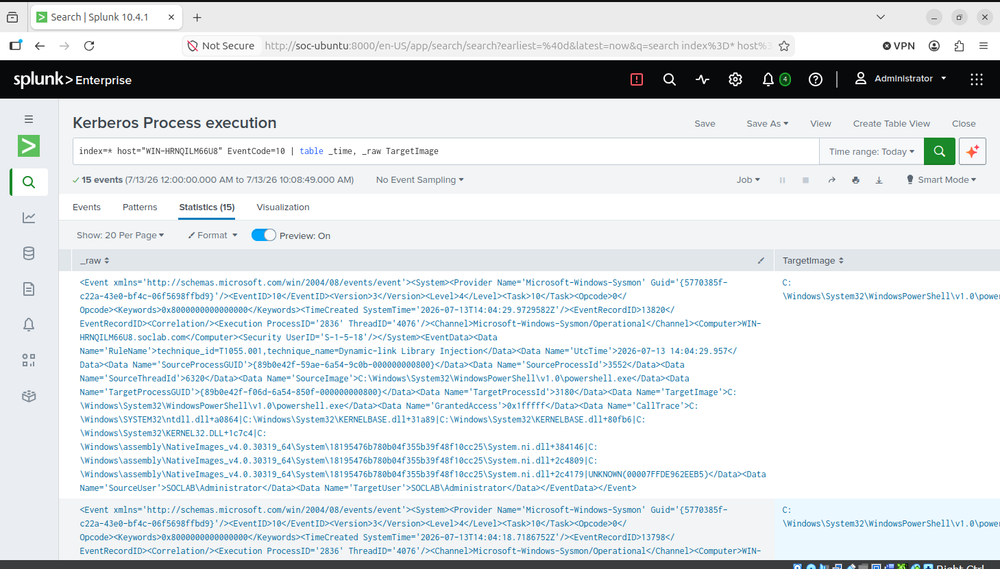
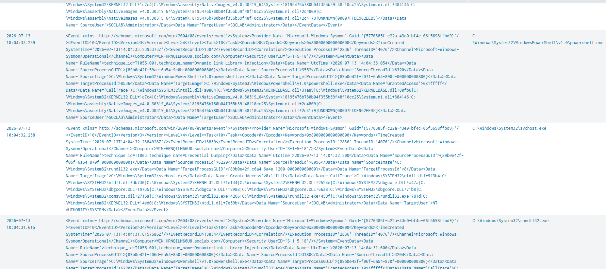

That chain continued into the credential dumping step itself: `rundll32.exe` accessing `svchost.exe` with full access, running as `NT AUTHORITY\SYSTEM` and tagged directly as `technique_id=T1003, technique_name=Credential Dumping`.

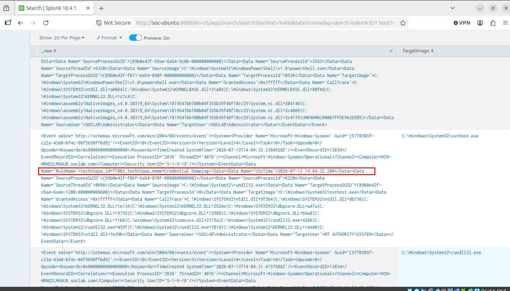

I ran a new search to pull the command lines which confirmed that `rundll32.exe` invoked `comsvcs.dll`'s `MiniDump` export against a process, writing the output to `svchost-exe.dmp`.

~~~spl linenums="1" title="Pull command lines for rundll32.exe"
index=* host="WIN-HRNQILM66U8" EventCode=1 | search Image="*rundll32.exe*" | table _time, CommandLine, ParentImage
~~~

~~~text linenums="1" title="Key command lines observed"
rundll32.exe C:\windows\System32\comsvcs.dll MiniDump 8 C:\Users\ADMINI~1\AppData\Local\Temp\svchost-exe.dmp full
~~~

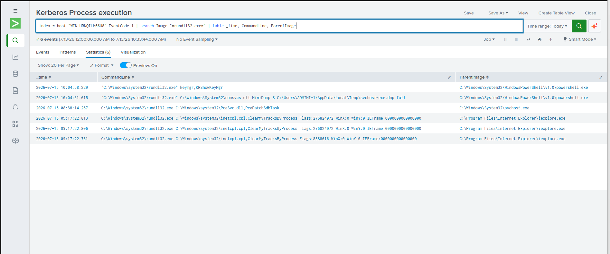

<!-- ---

## Findings & Lessons Learned (Lab-Wide) -->

---

## Next Steps

- Test more MITRE ATT&CK techniques and investigate them.
- Forward the pfSense logs to Splunk.
- Test on the Windows 10 computer that joins the AD.